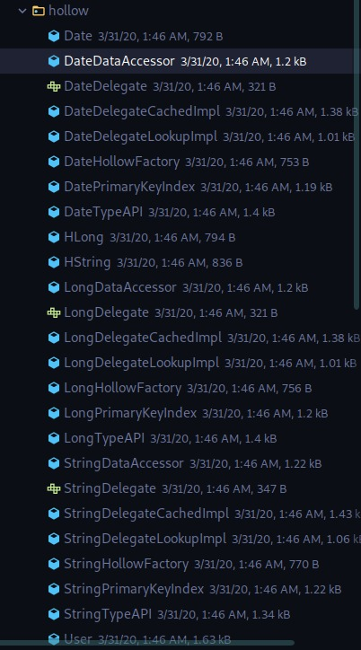
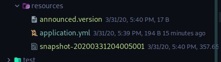
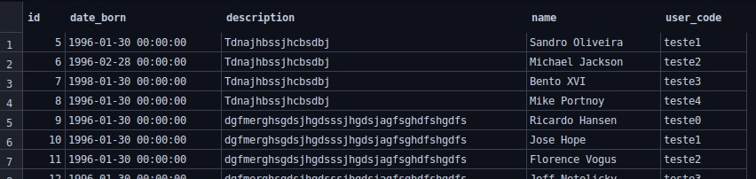
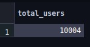
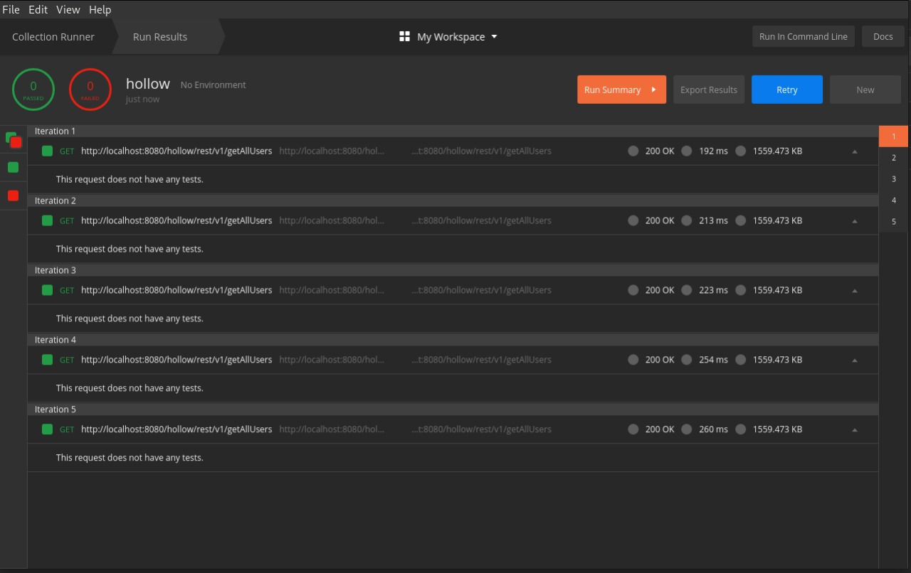
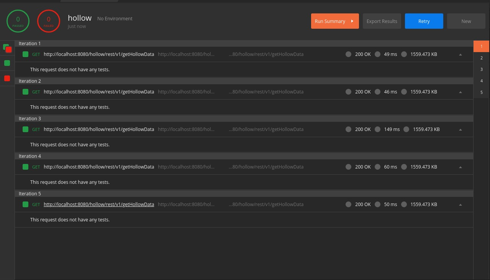

# hollow-poc

This project aims to test the netflix Hollow library. <br />


### Main Technologies

+ Java 11
+ Kotlin
+ Spring Boot 
+ Spring JPA
+ Hollow Lib
+ Mysql
+ Docker

### Useful links
+ [Blog Netflix Tech](https://netflixtechblog.com)
+ [Hollow Lib Documentation](https://hollow.how/)

### What is Hollow?

We as developers already face problems, ~~or not~~, related to application cache, among them, how to use, 
where to use and how to store! Hollow came as an option to facilitate our application cache management, 
and its storage and use is very easy to be manipulated!
Or according of Netflix:

```
"Hollow is a java library and comprehensive toolset 
for harnessing small to moderately sized in-memory 
datasets which are disseminated from a single producer 
to many consumers for read-only access."
```

## Use in POC
In this project, we use only a small demonstration of this powerful tool:

+ ##### Step 1 - Configurate project in Spring Web Service
    In addition to the necessary imports for Spring, we also import the Hollow lib:
    ```xml
    <dependency>
        <groupId>com.netflix.hollow</groupId>
        <artifactId>hollow</artifactId>
        <version>4.8.0</version>
    </dependency>
    ```
  
  After this import, we set up the date generator, that is, where all the data in your cache will be saved that will 
  be used in a future consultation!
  
  **HollowDataGeneration.kt**
  ```kotlin
  @Component
  class HollowDataGeneration  {
  
      private final val localPublishDir = Path.of("src/main/resources")
      val publisher = HollowFilesystemPublisher(localPublishDir)
      val announcer = HollowFilesystemAnnouncer(localPublishDir)
  
      fun dataGenerator(data: Any) {
          val hollowProducer = HollowProducer.withPublisher(publisher).withAnnouncer(announcer).build()
  
          hollowProducer.runCycle { state: HollowProducer.WriteState ->
              if (data is List<*>) {
                  data.stream().forEach { state.add(it) }
              }
          }
      }
  }
  ```
+ ##### Step 2 - Generate api to management
    We will now generate the classes to manage the manipulation and also the saved data consumption! 
    
    **HollowApiGeneration.kt**
    ```kotlin
    @Component
    class HollowApiGeneration {
    
        final val writeEngine = HollowWriteStateEngine()
        val mapper = HollowObjectMapper(writeEngine)
    
        fun generateApi() {
            mapper.initializeTypeState(User::class.java)
            val apiGeneration = HollowAPIGenerator.Builder()
                    .withAPIClassname("UserAPI")
                    .withPackageName("com.hotmart.hollowpoc.hollow")
                    .withDataModel(writeEngine)
                    .withDestination("src/main/kotlin/com/hotmart/hollowpoc/hollow")
                    .build()
            apiGeneration.generateSourceFiles()
        }
    }
    ```
  
  This is the file tree generated by Hollow! ~~And yes, there are many classes generated by the hollow!~~
  
  
+ ##### Step 3 - Create consumer api
    In the end we created, perhaps one of the most anticipated and important parts, 
    the consumption of our data in cache!
    
    **HollowConsumerConfig.kt**
    ```kotlin
    @Component
    class HollowApiGeneration {
    
        val writeEngine = HollowWriteStateEngine()
        val mapper = HollowObjectMapper(writeEngine)
    
        fun generateApi() {
            mapper.initializeTypeState(User::class.java)
            val apiGeneration = HollowAPIGenerator.Builder()
                    .withAPIClassname("UserAPI")
                    .withPackageName("com.hotmart.hollowpoc.hollow")
                    .withDataModel(writeEngine)
                    .withDestination("src/main/kotlin/com/hotmart/hollowpoc/hollow")
                    .build()
            apiGeneration.generateSourceFiles()
        }
    }
    ```
  
## Consuming data

   To consume the data, two tests were performed on a database in Mysql with approximately 10,000 users, 
   one with normal consumption, using sql query to bring all the data and then a query using Hollow. 
   The cached data has been stored locally in the following directory: `src/main/resources`
   
   **Datas**
   
   
   **Let's go to the tests:**
   
   **Table user**
   
   
   **Table user count**<br>
  
   
   A normal consumption, in a sql query, had the following characteristics (Running in Postman):
   
   + **Time**:
   Avarage of: 228.4
   
   **Postman Runner***
   
   
  Using the cached data, we have the following result (Running in Postman):
  
  + **Time**:
  Avarage of: 70.8
  
  **Postman Runner***
  
   
   We can see that there is a big improvement in relation to the response time of the data request!
   
## Conclusions

Hollow seems to be a very powerful tool to be used in applications that demand agility and usability for the end user and not only that, for those who are also developers, it can be very intuitive, sometimes.

But I couldn't finish this POC without testing the pros and cons!

   + Pros:
        - Intuitive configuration, helping faster development;
        - Integration with AWS! Hollow can be integrated into both S3 and dynamoDB so you can create your
        cache stack the way you want. [See more](https://hollow.how/quick-start/);
        - The cache files are in bitcodes and are very small.
  
   + Cons:
        - The documentation is still from a very old version! Bumping into deprecated methods often;
        - Little implementation in the community, you don't see some blogs or websites showing the implementation, 
        only on Netflix's github;
        - Generates unnecessary files for those just experimenting with lib

More information or any questions, just look for me!

## References

Github reference implementation - https://github.com/Netflix/hollow-reference-implementation)<br>
Hollow getting start - https://hollow.how/getting-started/
Github Hollow - https://github.com/Netflix/hollow
